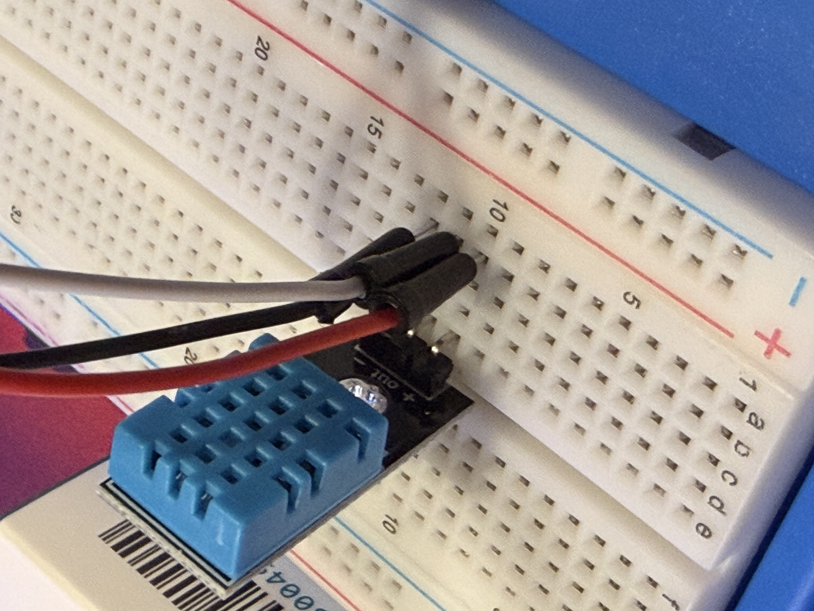
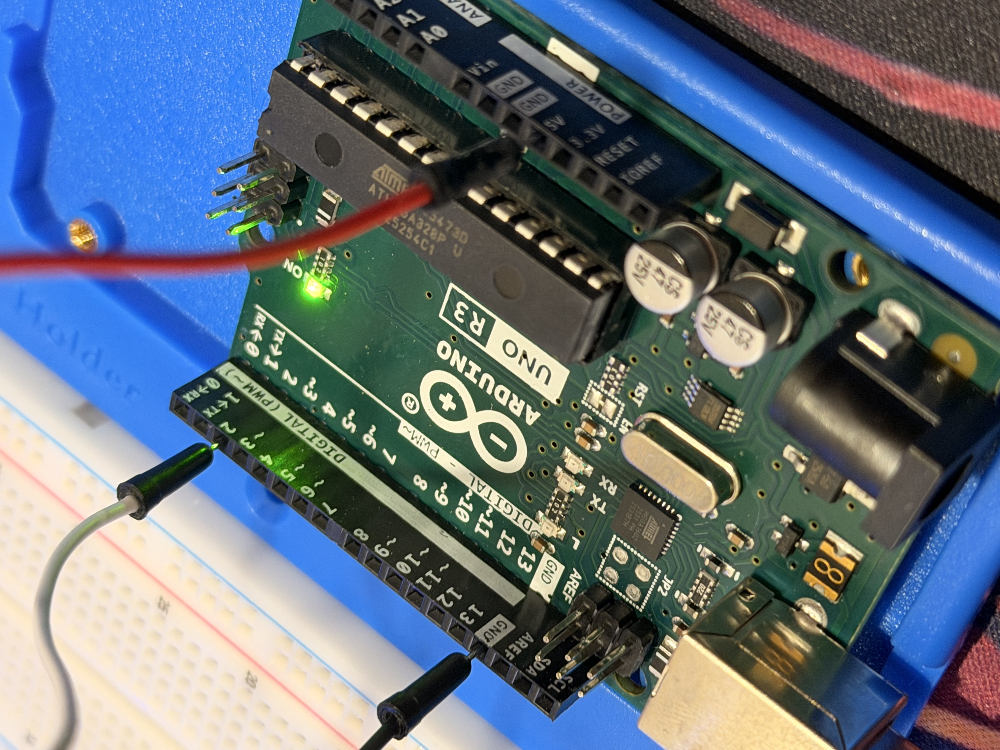
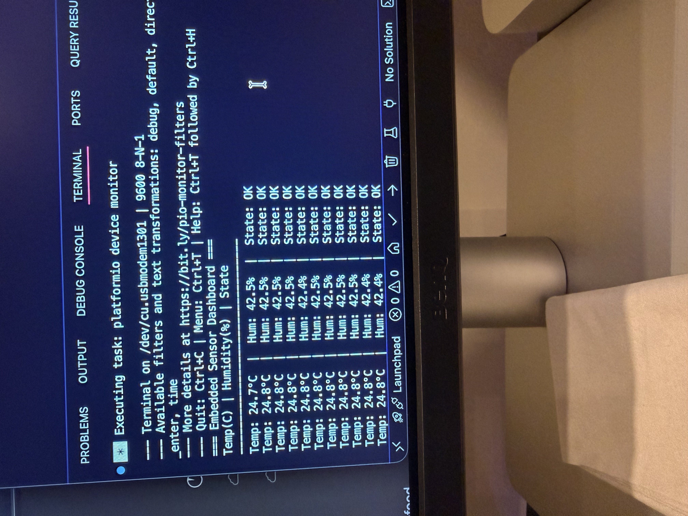

# dht11-fsm-dashboard

> A real-time embedded sensor monitoring system built in C++ for the Arduino Uno R3.  
> Implements a finite state machine with hardware alert output, a compile-time circular buffer  
> for noise filtering, and a fully modular library architecture with zero dynamic memory allocation.


---

## Table of Contents

- [Overview](#overview)
- [Features](#features)
- [System Architecture](#system-architecture)
- [Hardware](#hardware)
  - [Components](#components)
  - [Wiring Diagram](#wiring-diagram)
- [PCB Design](#pcb-design)
- [Project Structure](#project-structure)
- [Key C++ Concepts](#key-c-concepts)
  - [Circular Buffer Template](#circular-buffer-template)
  - [Finite State Machine](#finite-state-machine)
  - [Non-Blocking Timing](#non-blocking-timing)
- [Getting Started](#getting-started)
  - [Prerequisites](#prerequisites)
  - [Installation](#installation)
  - [Upload & Run](#upload--run)
- [Serial Output](#serial-output)
- [Configuration](#configuration)
- [Roadmap](#roadmap)
- [Why This Project](#why-this-project)
- [License](#license)

---

## Overview

`dht11-fsm-dashboard` is a from-scratch embedded C++ project targeting the **Arduino Uno R3**
(ATmega328P, 8-bit AVR, 2KB SRAM, 32KB Flash). It reads temperature and humidity from a
**DHT11 sensor**, filters noisy readings using a **moving average over a fixed-size circular
buffer**, and drives a **three-state finite state machine** that controls an LED alert output
based on configurable thresholds.

The project is intentionally structured as a **multi-library C++ codebase** rather than a
single-file Arduino sketch, mirroring how real firmware teams organize production code.

---

## Features

| Feature | Implementation |
|---|---|
| Sensor reading | DHT11 over single-wire GPIO |
| Noise filtering | 5-sample moving average via `CircularBuffer<T, N>` |
| Alert logic | 3-state FSM: `OK` → `WARNING` → `CRITICAL` |
| Hardware output | LED driven HIGH on `CRITICAL` state |
| Timing | Non-blocking `millis()` pattern, no `delay()` |
| Serial output | Structured UART at 9600 baud |
| Memory safety | Zero heap allocation, no `new` / `delete` / `malloc` |
| Build system | PlatformIO with C++17 flags |
| Modularity | 3 decoupled libraries: SensorLib, AlertLib, BufferLib |

---

## System Architecture

```
┌─────────────────────────────────────────────────────┐
│                    main.cpp                         │
│  setup() / loop() — orchestrates timing & I/O       │
└────────────┬──────────────────┬─────────────────────┘
             │                  │
     ┌───────▼──────┐   ┌───────▼────────┐
     │  SensorLib   │   │   AlertLib     │
     │  Sensor.h/.cpp│  │  AlertSystem   │
     │               │  │  .h/.cpp       │
     │  DHT11 wrap   │  │                │
     │  Reads raw    │  │  FSM States:   │
     │  temp & hum   │  │  OK            │
     │  Pushes to    │  │  WARNING       │
     │  buffer       │  │  CRITICAL      │
     └───────┬───────┘  └───────┬────────┘
             │                  │
     ┌───────▼──────────────────▼────────┐
     │            BufferLib              │
     │       CircularBuffer<T, N>        │
     │                                   │
     │  Fixed-size ring buffer template  │
     │  Compile-time capacity (no heap)  │
     │  O(1) push, O(N) average          │
     └───────────────────────────────────┘

Hardware Layer
──────────────
DHT11 ──── D2 (GPIO)      reads every 2000ms
LED   ──── D13 (GPIO)     driven HIGH on CRITICAL state
UART  ──── USB Serial     prints summary every 5000ms
```

---

## Hardware

### Kit

This project was built using the **SunFounder Inventor Lab Starter Kit** which includes the original Arduino Uno R3 and all supporting components needed to get started with embedded development.

### Components Used

| Part | Source | Notes |
|---|---|---|
| Original Arduino Uno R3 | SunFounder Inventor Lab Kit | ATmega328P, 16MHz, 5V, ATmega16U2 USB chip |
| 830-hole Breadboard | SunFounder Inventor Lab Kit | Used for prototyping all connections |
| Jumper Wires | SunFounder Inventor Lab Kit | Male-to-male, 3 wires for DHT11 |
| USB Cable (USB-A to USB-B) | SunFounder Inventor Lab Kit | Powers and programs the board |
| DHT11 Temperature and Humidity Sensor | WWZMDiB (ordered separately) | 3-pin PCB module, pull-up resistor built in |

### Build Photos


*Full setup showing the Arduino Uno R3, breadboard, DHT11 sensor, and RAB holder*


*DHT11 module wired into the breadboard with power, data, and ground connections*


*Arduino Uno R3 with digital pin connections and green power LED lit*


*Live sensor data streaming in VS Code showing temperature, humidity, and FSM state*

### Wiring Diagram

```
Arduino Uno R3          DHT11 Sensor
──────────────          ────────────
5V  ────────────────── VCC  (pin 1)
GND ────────────────── GND  (pin 4)
D2  ────────────────── DATA (pin 2)

Note: The WWZMDiB DHT11 module has a built-in pull-up resistor
on the DATA line so no external resistor is needed.

Alert Output:
D13 connected to built-in LED (no wiring needed)
     OR
D13 connected through a 220Ω resistor to an external LED anode to GND
```

---

## PCB Design

This project includes a custom PCB design created in [EasyEDA](https://easyeda.com), fabricated by [PCBWay](https://www.pcbway.com).

This was my first PCB design — the board breaks out the Arduino Uno R3, DHT11 sensor, and LED alert circuit into a clean 2-layer layout (130x87mm).

[](https://www.pcbway.com)

### Board Specs

| Spec | Value |
|---|---|
| Dimensions | 130mm x 87mm |
| Layers | 2 |
| Thickness | 1.6mm |
| Surface Finish | HASL |
| Copper Weight | 1oz |

### Files

- Gerber files are located in the `/hardware` folder

---

## Project Structure

```
dht11-fsm-dashboard/
│
├── platformio.ini              # Board target, build flags, library deps
│
├── src/
│   └── main.cpp                # Entry point, setup(), loop(), timing logic
│
├── lib/
│   ├── SensorLib/
│   │   ├── Sensor.h            # DHT11 wrapper, reads, validates, buffers data
│   │   └── Sensor.cpp
│   │
│   ├── AlertLib/
│   │   ├── AlertSystem.h       # FSM definition, states, thresholds, transitions
│   │   └── AlertSystem.cpp     # State evaluation, LED control, label output
│   │
│   └── BufferLib/
│       └── CircularBuffer.h    # Generic fixed-size ring buffer (header-only template)
│
├── hardware/
│   └── gerber files            # PCB fabrication files for PCBWay
│
└── README.md
```

Each library is **self-contained**. `SensorLib` depends on `BufferLib`,
`AlertLib` is fully independent, and `main.cpp` depends on both.
This mirrors real firmware team conventions where modules are tested and
reviewed in isolation.

---

## Key C++ Concepts

### Circular Buffer Template

`CircularBuffer<T, N>` is a header-only, fully generic ring buffer with
compile-time capacity. It uses **no dynamic memory** and the internal array
is stack-allocated at the size `N` provided as a template parameter.

```cpp
// Zero-cost abstraction: capacity set at compile time
CircularBuffer<float, 5> tempHistory;

tempHistory.push(24.3f);   // O(1) insert
tempHistory.average();     // 5-sample moving average
tempHistory.size();        // how many values stored so far
```

Key design decisions:
- `uint8_t` used for index and count, saves SRAM on 8-bit MCU
- Overwrites oldest value when full (ring semantics)
- `operator[]` provides logical index access (0 = oldest)
- Template allows reuse for any numeric type

### Finite State Machine

`AlertSystem` implements a classic embedded FSM with three states driven
by live sensor thresholds. State transitions are evaluated on every sensor
update and only hardware output and internal state change when a transition occurs.

```
         temp < 28°C AND hum < 70%
    ┌──────────────────────────────────┐
    │                                  │
  ┌─▼─┐   temp ≥ 28°C OR hum ≥ 70%  ┌─▼───────┐
  │ OK│ ─────────────────────────────► WARNING  │
  └───┘                               └────┬────┘
    ▲                                       │
    │      temp ≥ 35°C OR hum ≥ 85%        │
    │   ┌──────────────────────────────────►│
    │   │                               ┌───▼──────┐
    └───┤  all readings back in range   │ CRITICAL │
        └───────────────────────────────┤  LED ON  │
                                        └──────────┘
```

```cpp
// Thresholds are configurable at startup via a struct
constexpr Thresholds THRESHOLDS = {
    .tempWarning  = 28.0f,
    .tempCritical = 35.0f,
    .humWarning   = 70.0f,
    .humCritical  = 85.0f
};
```

`enum class AlertState` is used instead of plain `enum` or `#define` constants,
providing scoped, type-safe state values that prevent accidental integer comparisons.

### Non-Blocking Timing

No `delay()` is used anywhere in the codebase. All timing uses the
`millis()` delta pattern, which is standard practice in real embedded systems
where blocking calls prevent the processor from handling other tasks.

```cpp
uint32_t lastReadMs = 0;

void loop() {
    uint32_t now = millis();

    if (now - lastReadMs >= READ_INTERVAL_MS) {
        lastReadMs = now;
        sensor.read();   // only called every 2 seconds
    }
}
```

This pattern scales cleanly. Adding a second sensor, an LCD update,
or a button debounce follows the same structure with no interference.

---

## Getting Started

### Prerequisites

- [VS Code](https://code.visualstudio.com/) 
- [PlatformIO IDE extension](https://marketplace.visualstudio.com/items?itemName=platformio.platformio-ide)
- USB-A to USB-B cable (included in the SunFounder kit)
- USB-C adapter if using a device with only USB-C ports

### Installation

```bash
# Clone the repository
git clone https://github.com/gmahfood/dht11-fsm-dashboard.git
cd dht11-fsm-dashboard

# Open in VS Code
code .
```

PlatformIO will automatically detect `platformio.ini` and download all
library dependencies (`DHT sensor library`, `Adafruit Unified Sensor`)
on first build. No manual library installation required.

### Upload & Run

1. Connect your Arduino Uno R3 via USB
2. In VS Code, click the **Upload** button in the PlatformIO toolbar
3. Wait for `SUCCESS` in the terminal output
4. Open the serial monitor:

```bash
pio device monitor
# or use the plug icon in the PlatformIO toolbar
```

**macOS users:** If the port is not detected, check System Settings →
Privacy & Security → allow the USB serial driver.

---

## Serial Output

At 9600 baud over USB serial:

```
=== Embedded Sensor Dashboard ===
Temp(C) | Humidity(%) | State
---------------------------------
Temp: 24.3°C  |  Hum: 55.2%  |  State: OK
Temp: 24.4°C  |  Hum: 55.5%  |  State: OK
Temp: 29.1°C  |  Hum: 71.3%  |  State: WARNING
Temp: 36.0°C  |  Hum: 86.2%  |  State: CRITICAL
```

Readings are printed every **5 seconds**. The sensor is sampled every
**2 seconds** (DHT11 minimum sampling interval) and values are averaged
across the last 5 samples before display.

If a read fails due to bad wiring or the sensor not being ready, a warning is printed:
```
[WARN] Sensor read failed, check wiring
```

---

## Configuration

All tuneable values are `constexpr` constants in `main.cpp`:

```cpp
constexpr uint8_t  DHT_PIN           = 2;      // Change to your wiring
constexpr uint8_t  LED_PIN           = 13;     // D13 = built-in LED
constexpr uint32_t READ_INTERVAL_MS  = 2000;   // DHT11 minimum: 1000ms
constexpr uint32_t PRINT_INTERVAL_MS = 5000;   // Serial output frequency

constexpr Thresholds THRESHOLDS = {
    .tempWarning  = 28.0f,   // °C
    .tempCritical = 35.0f,   // °C
    .humWarning   = 70.0f,   // %
    .humCritical  = 85.0f    // %
};
```

To use a **DHT22** instead of DHT11, update one line in `src/main.cpp`:
```cpp
// Change this:
Sensor sensor(DHT_PIN, DHT11);
// To this:
Sensor sensor(DHT_PIN, DHT22);
```

---

## Roadmap

- [ ] I2C LCD display (16x2) to show readings without a PC connected
- [ ] SD card data logging with timestamps via SPI
- [ ] EEPROM persistence to save thresholds across power cycles
- [ ] Push-button to silence CRITICAL alert with debounce
- [ ] Second sensor input (soil moisture or light level)
- [ ] Custom 3D printed enclosure designed for the Bambu Labs P2S — housing the PCB and LCD in a clean package
- [x] Custom PCBWay PCB designed in EasyEDA & fabricated by PCBWay *(first PCB design!)*
- [ ] Unit tests with `googletest` on host machine

---

## Why This Project

Most Arduino tutorials produce single-file `.ino` sketches with global
variables and `delay()` calls. This project deliberately avoids all of
that. The goal was to write C++ the way it would be written in a
professional embedded or robotics context:

- **Encapsulation** over global state
- **Templates** for zero-cost generic data structures
- **`enum class`** over raw integers for type safety
- **`constexpr`** over `#define` for compile-time constants
- **Non-blocking loops** over `delay()` for real-time readiness
- **Modular libraries** over monolithic sketches for testability

This architecture scales. The same patterns used here, FSMs, ring
buffers, and hardware abstraction classes, appear in production firmware
for medical devices, automotive ECUs, and robotics controllers.

---

## License

MIT, free to use, modify, and build on.
